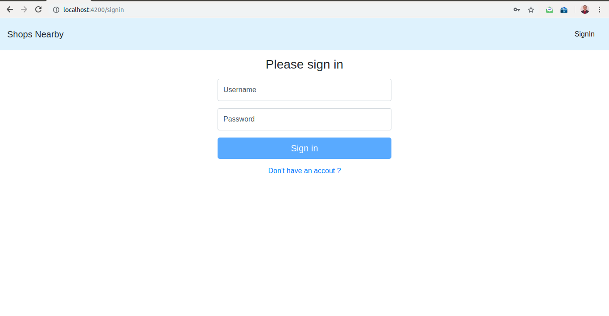
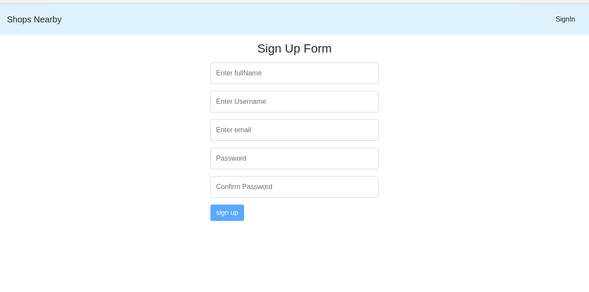
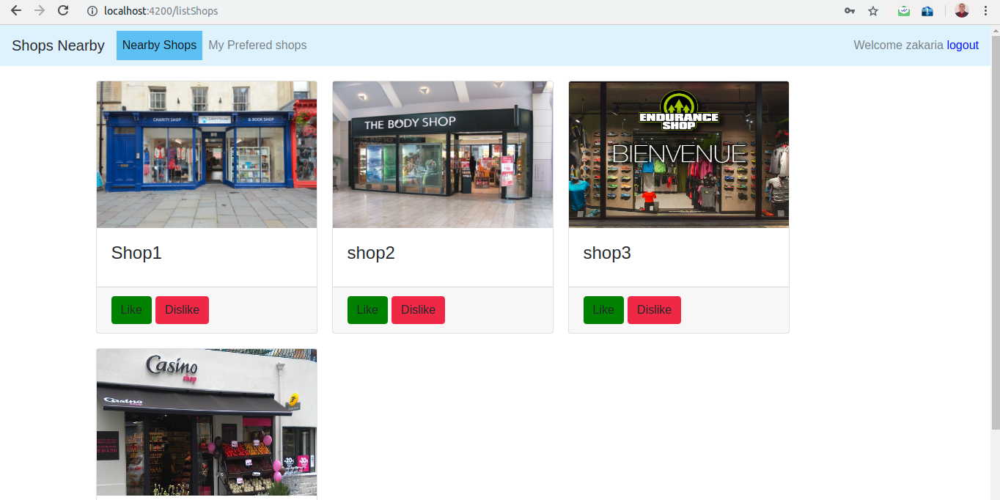
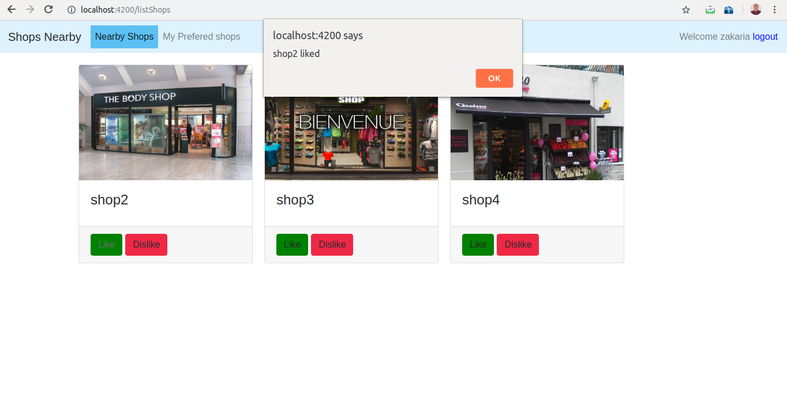
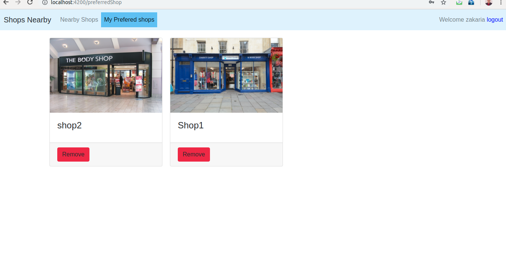
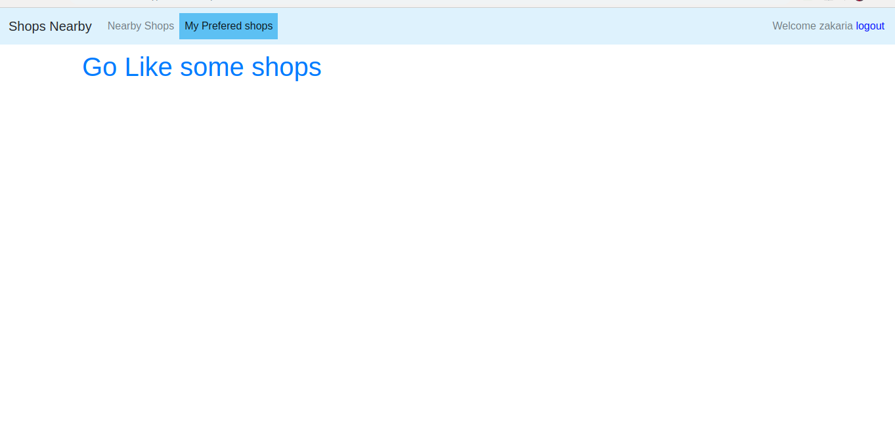
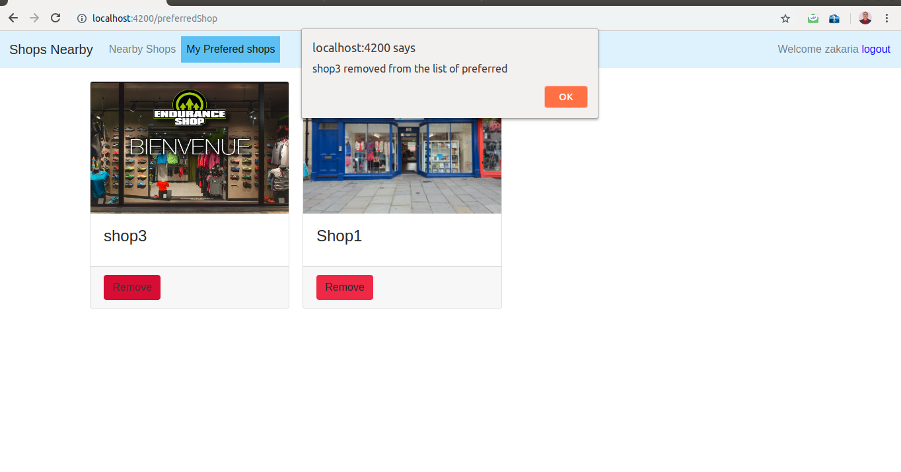
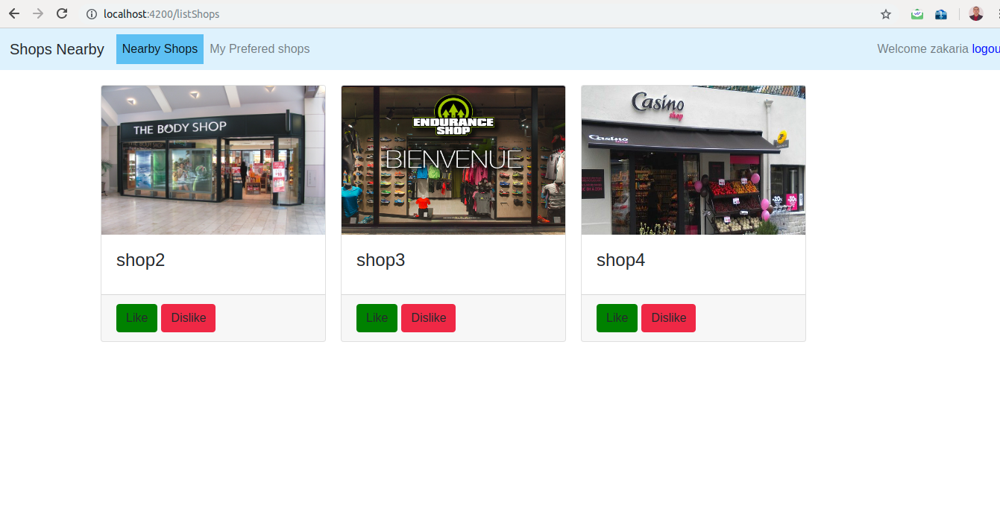

## WHAT IS NEARBY-SHOPS ?

NEARBY-SHOPS is a web application, builded with ANGULAR 7 at client side and JAVA/JEE (SPRING)  at the server side, that provide to a user the possibility to consult all the nearby shops.

## Functional spec

- .As a User, I can sign in using my username &amp; password to display all the nearby shops.
- .As a User, I can sign up using my username &amp; password &amp; fullName.
- .As a User, I can display the list of shops sorted by distance.
- .As a User, I can like a shop, so it can be added to my preferred shops ( NW : liked shops will not be displayed on the main page ).
- .AS a User, I can remove a shop from my preferred shops so it will displayed again in the main page.

## Development tools

1. Client Side :
   1. Angular7
   1. Bootstrap

1. Server Side :

   1. Java 8
   1. Maven
   1. Spring Boot 1.1.RELEASE
   1. Sring data jpa
   1. Spring Rest
   1. Spring security
   1. Json web token
   1. MySql

## Presentation of the application

Once the application is launched the form of sign in is displayed you cannot display nearby shops if you are not authenticated.

If you do not have an account you can click on the &#39;don&#39;t have an account?&#39; link to create a new User for goal to display all the nearby shops, otherwise login with your username and password and you will be redirected to the nearby shops.

Once you logged In you have the permission to navigate to the nearby shops and your preferred shops.

The nearby shops will be displayed with name, picture and two buttons like and dislike.

You can like a nearby shop, once you do that that, it will be displayed in you preferred shops component and automatically will be removed from the list of nearby shops.

If you still do not like any nearby shop and navigate to the preferred shops, a message will display with &#39;Go Like some shops&#39;, else the shops will be displayed with name, picture and a button remove.

Once you click on the remove button the shop will be removed from your preferred shops and it will be displayed again at the nearbyShops

## Installation

1. download or clone the code source from the git repository
   `git clone http://github.com/mrnobody3/Nearby-Shops`
1. Navigate to the directory downloaded
   `cd [Path to Nearby-Shops]`
1. Navigate to the backend server and apply this commands to run the application
   `maven package`
   `mvn install`
   `mvn spring-boot:run`
1. Navigate the frontend server and apply this commands
   `npm install`
   `ng serve`
1. Go to [http://localhost:4200] (http://localhost:4200)

#

#

#
